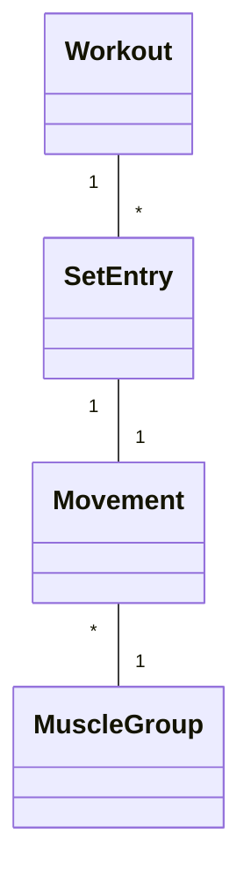
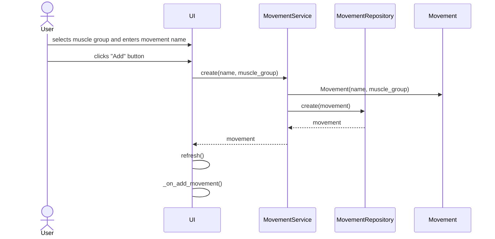

## Luokkakaavio

```mermaid
classDiagram
    class Workout {
       
    }
    class SetEntry {

    }
    class Movement {
       
    }
    class MuscleGroup {
        
    }
    
    Workout "1" -- "*"  SetEntry
    SetEntry "1" -- "1" Movement
    Movement "*" -- "1" MuscleGroup
```

## Liikkeen luominen

```mermaid
sequenceDiagram
  actor User
  participant UI
  participant MovementService
  participant MovementRepository
  participant Movement
  User ->> UI: selects muscle group and enters movement name
  User ->> UI: clicks "Add" button
  UI ->> MovementService: create(name, muscle_group)
  MovementService ->> Movement: Movement(name, muscle_group)
  MovementService ->> MovementRepository: create(movement)
  MovementRepository -->> MovementService: movement
  MovementService -->> UI: movement
  UI -> UI: refresh()
  UI -> UI: _on_add_movement()
```