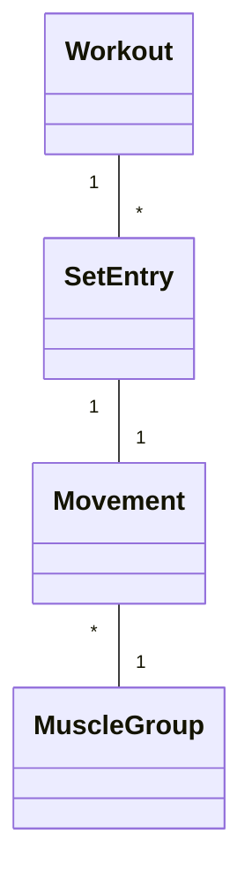
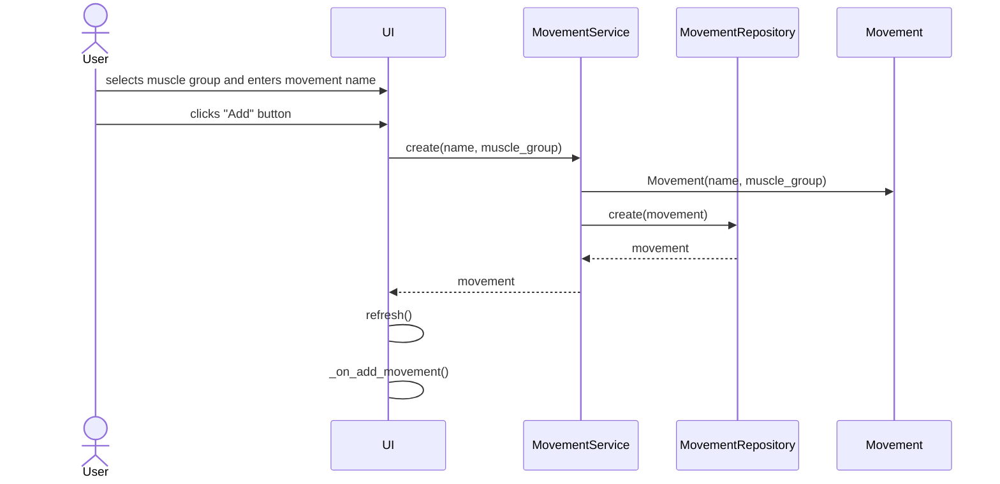

# Arkkitehtuurikuvaus

## Rakenne
Ohjelma noudattaa kolmitasoista kerrosarkkitehtuuria. Käyttöliittymästä, sovelluslogiikasta ja tietojen pysyväistallennuksesta vastaavat koodit on eroteltu omiin pakkauksiinsa ***ui***, ***services*** ja ***repositories***. Sovelluksen käyttämät tietokohteet on myös määritelty omassa pakkauksessaan ***entities***. Liian monen turhan tietokantaoperaation välttämiseksi on myös käyttöliittymän tarvitsemat kevyemmät tietokohteet määritelty pakkauksessa ***dto***.

## Sovelluslogiikka
Sovelluksen loogisen tietomallin muodostavat luokat Workout, SetEntry, Movement ja MuscleGroup. Luokkien yhteydet voidaan havainnollistaa luokkakaaviolla:

Sovelluksen toiminnallisuuksista vastaa ***services*** pakkauksen luokat ***MovementService***, ***WorkoutService***, ***MuscleGroupService*** ja ***AnalysisService***. Näillä luokilla on yhdet oliot, jota käyttöliittymä käyttää. Pysyvän tiedon käsiin ***services*** pakkauksen luokat pääsevät ***repositories*** pakkauksen luokkien ***WorkoutRepository***, ***MovementRepository*** ja ***MuscleGroupRepository*** kautta. ***WorkoutRepository***, ***MovementRepository*** ja ***MuscleGroupRepository*** luokkien oliot injektoidaan konstruktorin kautta ***services*** pakkauksen luokille.

## Toiminnallisuuksia

### Liikkeen luominen sekvensiikaaviona

