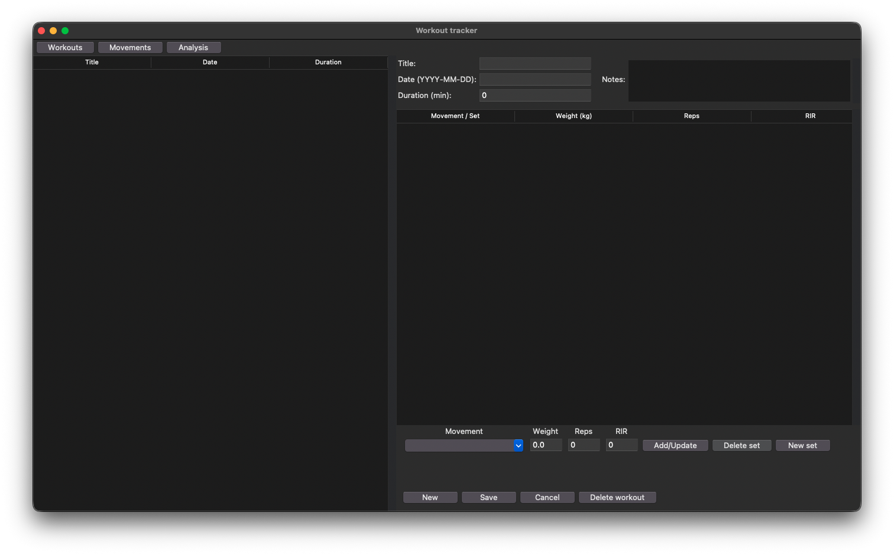
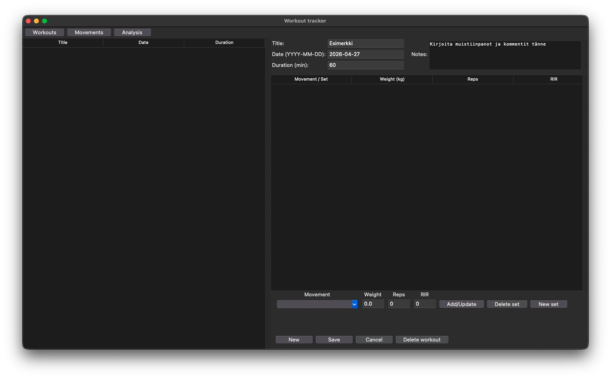
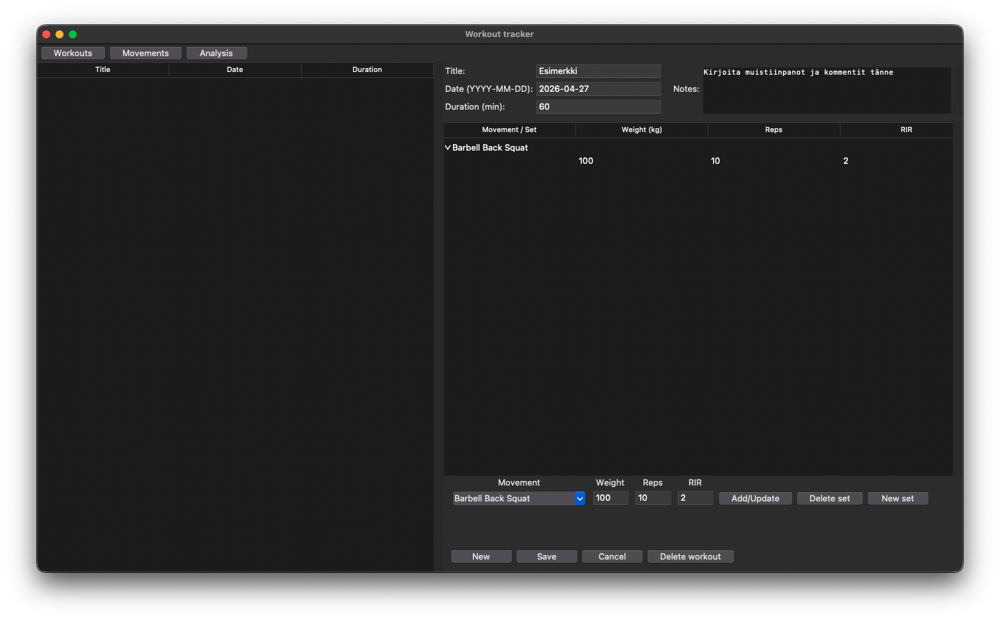
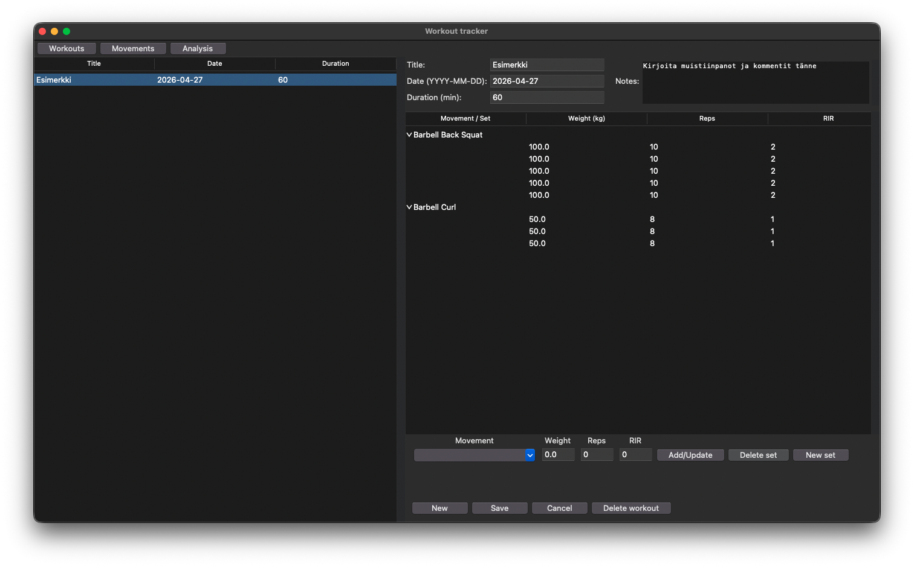
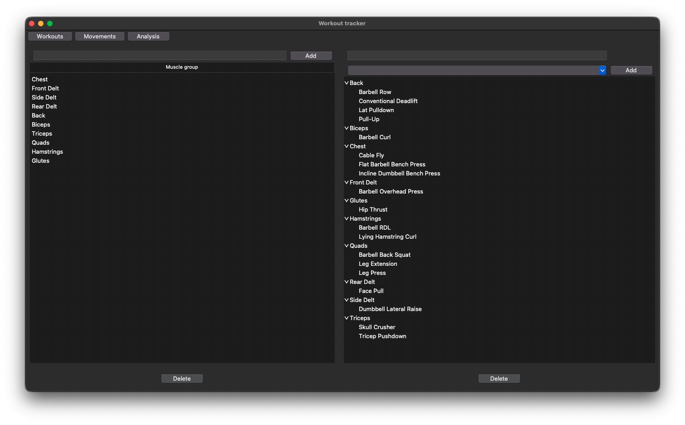
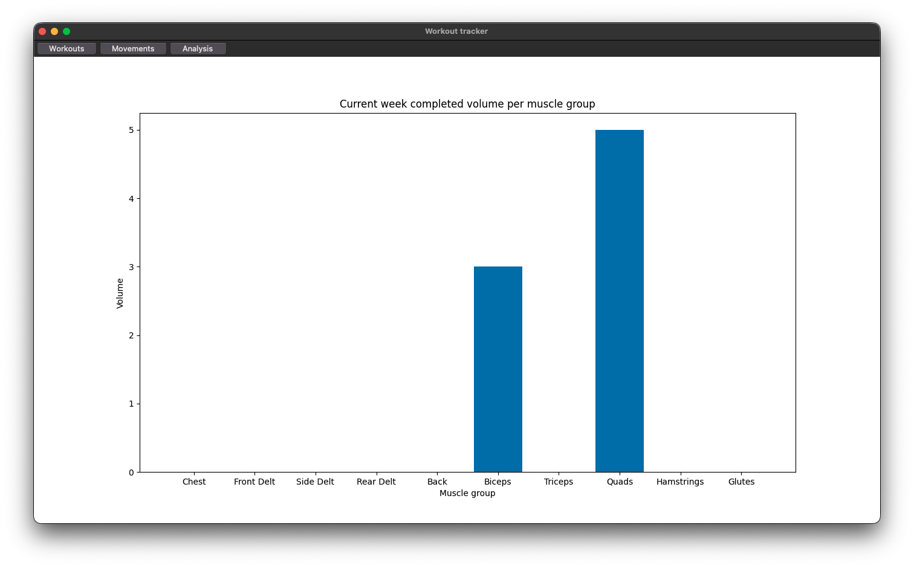

# Käyttöohje

## Konfigurointi

Luo tiedosto *.env* projektin juurihakemistoon. Tässä tiedostossa voi halutessaan konfiguroida titokantatiedoston nimen. Tietokantatiedosto luodaan automaattisesti *data*-hakemistoon. Tiedoston muoto tulee olla samankaltainen kuin esimerkkitiedosto *.env.example*:

```bash
DATABASE_FILENAME=database.db
```

## Ohjelman käynnistäminen

Ennen ohjelman käynnistämistä, asenna riippuvuudet komennolla:

```bash
poetry install
```

Jonka jälkeen suorita alustustoimenpiteet komennolla:

```bash
poetry run invoke build
```

Nyt ohjelman voi käynnistää komennolla:

```bash
poetry run invoke start
```

## Tervetuloa
Sovellus aukeaa treeninäkymään:



Sovelluksesa on kolme näkymää, joiden välillä voit liikkua ylhäältä löytyvien painikkeiden avulla

## Treenin kirjaaminen
Treeninäkymä on treenien kirjaamista ja tarkastelua varten. Voit kirjata treenin seuraavasti:

Syötä treenin yleistiedot lomakkeen yläosaan:


Syötä ensimmäisen sarjan tiedot lomakkeen alaosaan ja lisää se treeniin painamalla "Add/Update"-painiketta:

Voit lisätä monta samaa sarjaa peräkkäin helposti painamalla "Add/Update"-painiketta uudestaan. Sarjan tiedot voi myös nopeasti tyhjentää toista sarjaa varten painamalla "New set"-painiketta.

Kun olet syöttänyt kaikki treenin sarjat, voit kirjata treenin painamalla "Save"-painiketta alalaidasta. Treeni on nyt kirjattu.


Uuden treenin kirjaamista varten paina "New"-painiketta, jolloin saat tyhjän lomakkeen uutta treeniä varten.

### Treenin muokkaaminen ja poistaminen
Valitse treeni tarkasteltavaksi painamalla sen riviä vasemmanpuoleisesta treenilistasta. Valitun treenin tiedot täyttyvät oikeanpuoleiseen lomakkeeseen. Voit muokata treenin tietoja lomakkeessa. Sarjan muokkaamista varten valitse halutun sarjan rivi sarjalistasta lomakkeen keskeltä, jolloin sen tiedot täyttyvät alalaidan lomakkeeseen. Voit muuttaa valitun sarjan tietoja lomakkeessa ja päivittää ne painamalla "Add/Update"-painiketta. Valitun sarjan voi postaa painamalla "Delete set"-painiketta. Treenin muutokset voit tallentaa painamalla "Save"-painiketta. Tallentamattomat muutokset voidaan perua ja palauttaa treeni alkuperäiseen tilaansa painamalla "Cancel"-painiketta. Valitun treenin voi poistaa painamalla "Delete"-painiketta.

## Liikkeiden ja lihasryhmien hallinta
Sovelluksessa tulee annettuna lihasryhmiä ja liikkeitä. Halutessaan käyttäjä voi lisätä ja poistaa lihasryhmiä ja liikkeitä. Tämä onnistuu liikenäkymästä, johon pääsee painamalla ylhäältä "Movements"-painiketta. Liikenäkymä näyttää tältä:



Lihasryhmän voi lisätä kirjoittamalla sen nimen vasempaan kenttään ja painamalla "Add"-painiketta. Lihasryhmän voi poistaa valitsemalla se listasta ja painamalla "Delete"-painiketta. Liikkeiden lisääminen ja poistaminen toimii samalla tavalla, mutta nimen lisäksi täytyy valita lihasryhmä jota liike ensisijaisesti kuormittaa.

## Analyysinäkymä
Analyysinäkymässä näät kuinka monta sarjaa olet kirjannut kullekkin lihasryhmälle nykyisen viikon aikana. Analyysinäkymään pääsee painamalla "Analysis"-painiketta. Analyysinäkymä näyttää tältä:

