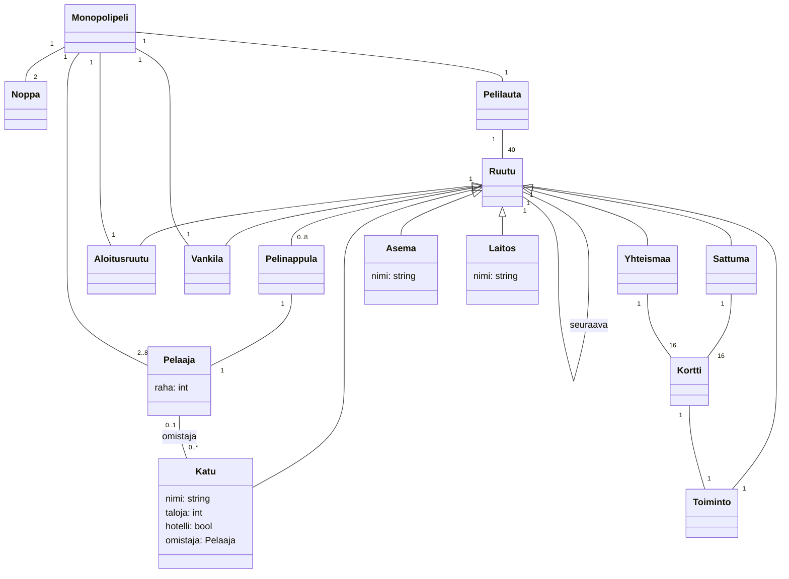

```mermaid
 classDiagram
    Monopolipeli "1" -- "2" Noppa
    Monopolipeli "1" -- "1" Pelilauta
    Pelilauta "1" -- "40" Ruutu
    Ruutu "1" -- "1" Ruutu : seuraava
    Ruutu "1" -- "0..8" Pelinappula
    Pelinappula "1" -- "1" Pelaaja
    Pelaaja "2..8" -- "1" Monopolipeli
    Ruutu <|-- Aloitusruutu
    Ruutu <|-- Vankila
    Ruutu <|-- Sattuma
    Ruutu <|-- Yhteismaa
    Ruutu <|-- Asema
    Ruutu <|-- Laitos
    Ruutu <|-- Katu
    Monopolipeli "1" -- "1" Aloitusruutu
    Monopolipeli "1" -- "1" Vankila
    Ruutu "1" -- "1" Toiminto
    Sattuma "1" -- "16" Kortti
    Yhteismaa "1" -- "16" Kortti
    Kortti "1" -- "1" Toiminto
    Pelaaja "0..1" -- "0..*" Katu : omistaja

    class Monopolipeli {
    }
    class Pelilauta {
    }
    class Ruutu {
    }
    class Aloitusruutu {
    }
    class Vankila {
    }
    class Sattuma {
    }
    class Yhteismaa {
    }
    class Asema {
        nimi: string
    }
    class Laitos {
        nimi: string
    }
    class Katu {
        nimi: string
        taloja: int
        hotelli: bool
        omistaja: Pelaaja
    }
    class Kortti {
    }
    class Pelinappula {
    }
    class Pelaaja {
        raha: int
    }
    class Noppa {
    }
    class Toiminto {
    } 
```